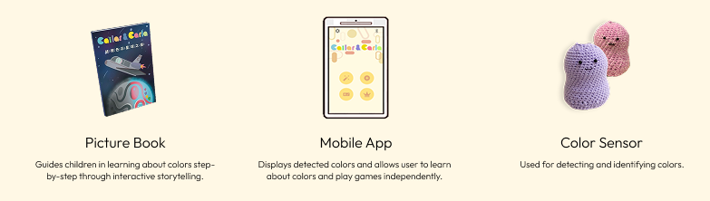

# Cailar & Carla: Color Learning Product
>**Bachelor Graduation Project | Sep 2020 - Dec 2021**

## Product Overview
**Cailar & Carla** is an interactive color learning product designed for elementary students (**ages 7–11**) to explore color theory through hands-on play. 
By integrating a **plush tactile controller** with a **gamified mobile app**, children can capture colors from their real-world environment and use them to solve color challenges. This project addresses the lack of engaging, depth-oriented color education in current curriculums.

## Product Highlights

  
  <em>Figure 1: Product Overview</em>

* **Tangible Interaction**: A plush-covered device encouraging physical exploration.
* **Gamified Pedagogy**: Transforms abstract color theory into an engaging story-driven game.
* **Full-Stack Integration**: End-to-end implementation from hardware sensors to mobile interface.

### Gallery

<table border="0" width="100%" align="center">
  <tr>
    <td colspan="3" align="center">
      
       
      <b>Figure 2:</b> Hardware Device & Interface
    </td>
  </tr>
  <tr>
    <td width="30%" align="center">
      
       
      2a. Data Visualization
    </td>
    <td width="30%" align="center">
      
       
      2b. Dynamic Game
    </td>
    <td width="40%" align="center">
      
       
      2c. Unity Battle Game
    </td>
  </tr>
</table>

---

## Repository Structure
This repository contains the complete source code for both the hardware and software components of the project:

* **CC_APP**: Contains the **Flutter & Unity** source code for the interactive mobile learning APP.
* **CC_ESP32.ino**: Contains the **ESP32 (NodeMCU32S)** firmware written in **Arduino** for color sensing and Bluetooth transmission.
* **docs**: Documentation assets.

---

## Technical Architecture (My Contributions)
As the **Team Leader & Lead Developer**, I was responsible for the **Hardware-Software Integration**, ensuring data flowed seamlessly from the sensor to the app.

### 1. IoT Communication Protocol (Firmware)
* **BLE Architecture**: Implemented a **GATT Server** on the ESP32 utilizing **Notify characteristics**. This enables the hardware to proactively push sensor data to the app upon button press, ensuring **real-time responsiveness** and power efficiency.
* **Data Serialization**: Formatted sensor readings into a lightweight CSV string (e.g., "R,G,B,Clear") for efficient parsing on the mobile end.

### 2. Mobile & Game Integration (Flutter & Unity)
* **Real-time Data Stream**: Implemented a `StreamBuilder` architecture in Dart to asynchronously parse incoming Bluetooth packets.
* **Reactive State Management**: Built a robust handler that updates the UI instantly **in sync with the physical button press**, ensuring zero perceptible latency between the hardware action and screen feedback.
* **Flutter-Unity Data Bridge**: Architected the communication channel between the **Flutter Host** (App) and the **embedded Unity Engine** to transmit sensor data in real-time.
* **Gameplay Logic Implementation (C#)**: Developed the core mechanics for the **"Battle Mode"**, including the win/loss state machine, health point (HP) calculation, and shooting logic (independent of sensor input).

### 3. Hardware Circuit Design
* **Power Management**: Integrated a Step-Down module to convert the **9V battery source to 5V**, providing stable power for the **NodeMCU-32S** and high-brightness **LED light reinforcement** (to compensate for ambient light).
* **Sensor Integration**: Interfaced the **TCS34725** color sensor via **I2C protocol**, ensuring accurate color acquisition.

  
   
  <em>Figure 3: Circuit Diagram & Power Management</em>

---

## System Features (Team Effort)
The project success relied on specialized modules developed by the team:

* **Heuristic Color Calibration**: The system incorporates a custom algorithm (developed by Po-Yin Pan) that converts raw RGB noise into stable HSL values, compensating for ambient light variations.
* **Ergonomic Product Design**: The device features a plush exterior and a 3D-printed internal structure (designed by Hsin-Yu Tsai) to protect the electronics while maintaining a soft, approachable tactile feel.

---

## Tech Stack

### **Hardware / Firmware**
* **Controller**: ESP32 (NodeMCU-32S)
* **Sensor**: TCS34725 Color Sensor
* **Circuitry**: 9V Power Supply, Step-Down Module
* **Protocol**: Bluetooth Low Energy (BLE) / GATT

### **Software / Mobile**
* **Mobile Framework**: Flutter (Dart)
* **Game Engine**: Unity (Integrated within Flutter)
* **Tools**: Arduino IDE, Visual Studio Code
* **Design**: Adobe Illustrator

---

## Team & Acknowledgments
This project received the **Honorable Mention Award** in the Graduation Project Competition.

* **Team Members**: Ming-Hua Hsieh (Team Leader & Lead Developer), Ching-Yung Fan, Hsin-Yu Tsai, Po-Yin Pan, and Li-Han Lin.
* **Supervisor**: Prof. Kun-Yi Lin (linkuenyi@ntnu.edu.tw)

* **Institution**: National Taiwan Normal University (NTNU)